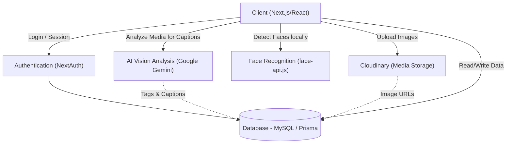

# GlimSync Architecture 🏗️

This document explains the architecture of the **GlimSync** event management and AI auto-tagging platform.

## 📊 Architecture Flow Diagram

Below is the visual block diagram representing the system flow from the client application down to the backend APIs, database, storage, and AI processing layers.

---

## 🧩 Component Breakdown

### 1. Client Layer (Frontend)
- **Next.js & React 19:** Orchestrates the user interface, routing, and real-time state management.
- **Client-Side Face Detection (`face-api.js`):** In-browser neural network models run on the user's browser using HTML5 Canvas to locate faces and extract facial landmarks and descriptors/embeddings. This saves server computation cost and ensures immediate user response times.

### 2. Authentication Layer (`NextAuth.js`)
- Protects administrative routes and manages login sessions.
- Directly communicates with the database layer to look up user identities and credentials.

### 3. Media & Assets Storage (Cloudinary)
- Handles image uploads directly and securely.
- Serves optimized responsive images back to the user interface.

### 4. Database Layer (Prisma & MySQL)
- Stores persistent relational records including users, events, media URLs, tags, and comments.

### 5. AI Processing (Google Gemini API)
- The server processes newly uploaded images by calling the Gemini Vision model to extract:
  - Natural language captions.
  - Descriptive labels and keyword tags.
- This data is then saved back to the database for high-performance searching.
