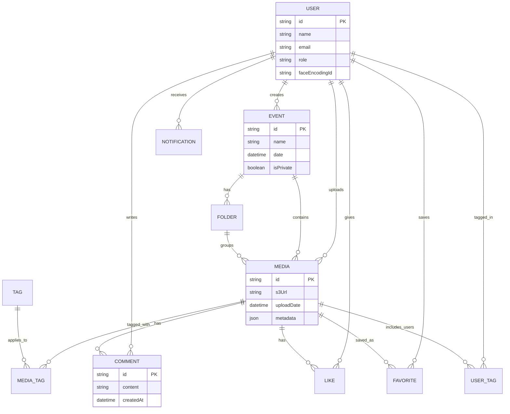

# GlimSync Database Schema & ERD 🗄️

This document describes the database schema, relational structure, and entities used in the **GlimSync** project. The schema is constructed using Prisma ORM connected to a MySQL database.

## 📊 Entity Relationship Diagram (ERD)

---

## 🗃️ Entity Descriptions

### 1. User
- **Fields:** `id` (PK), `name`, `email`, `passwordHash`, `role` (ADMIN, PHOTOGRAPHER, VIEWER), `faceEncodingId`.
- **Purpose:** Represents any system user. It keeps an optional facial signature/encoding so the platform can automatically identify them in newly uploaded photos.

### 2. Event
- **Fields:** `id` (PK), `name`, `description`, `date`, `isPrivate`, `creatorId` (FK).
- **Purpose:** Represents an organized gathering (e.g., weddings, parties, corporate events) to which photos are uploaded.

### 3. Folder
- **Fields:** `id` (PK), `name`, `eventId` (FK).
- **Purpose:** Helps categorize photos within a specific event (e.g., "Day 1", "Reception").

### 4. Media
- **Fields:** `id` (PK), `url` (Cloudinary Storage link), `eventId` (FK), `folderId` (FK), `uploaderId` (FK), `caption` (AI-generated), `createdAt`.
- **Purpose:** Stores the reference and details of every uploaded image.

### 5. MediaTag & Tag
- **Fields:** `mediaId` (FK), `tagId` (FK).
- **Purpose:** Holds keywords (e.g., "happy", "sunset", "outdoors") automatically generated by Google Gemini or added manually.

### 6. UserTag
- **Fields:** `mediaId` (FK), `userId` (FK).
- **Purpose:** Represents a custom join entity checking which users are recognized and tagged in a specific photo.

### 7. Comments, Likes, and Favorites
- **Purpose:** Enable standard social interactions for photos within the event galleries.

### 8. Notifications
- **Fields:** `id` (PK), `userId` (FK), `type` (TAGGED, COMMENT, LIKE), `message`, `isRead`.
- **Purpose:** Notifies users in real-time when they are tagged or when their photos receive likes/comments.
