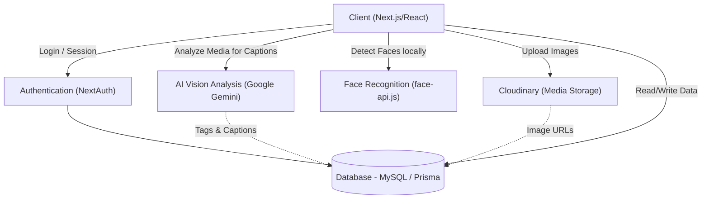
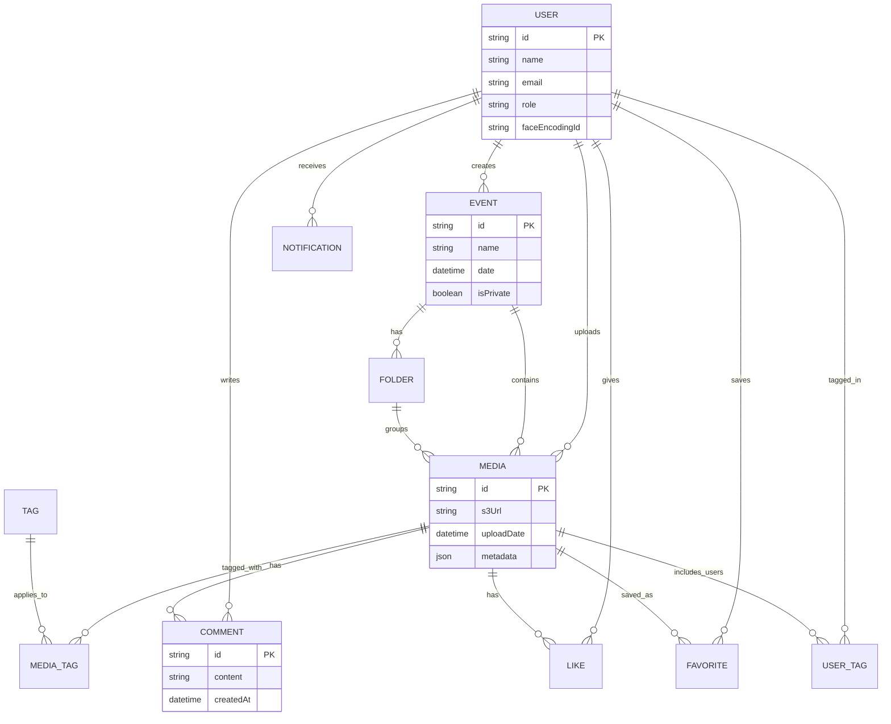

# GlimSync 📸

**GlimSync** is a cutting-edge, AI-powered platform designed for photographers and event organizers to effortlessly manage event media, auto-tag guests using facial recognition, and automatically generate smart captions and tags for photos using advanced AI models.

## 🚀 Live Demo
**[Working Deployed Project / Demo](https://event-management-glimsync-cig.vercel.app/)**

---

## 📦 Project Deliverables & Implemented Features

This section log documents the specialized UI/UX refinements, core AI features, and system architecture updates completed for this project:

### 1. Branding & Color Scheme
- **Logo Color Split:** Updated the main navbar logo to separate `"GlimSync"` into:
  - **Glim** styled in **dark navy blue** (`#1e3a8a`).
  - **Sync** styled in **solid black** (`#000000`).
- **Navbar Layout Correction:** Corrected active session state handling to prevent overlapping login/register buttons when a user is already authenticated. The navbar now shows *only* the user profile badge when logged in.

### 2. Visual Feed Optimization
- **4-Column Responsive Layout:** Re-engineered the media query breakpoints across all galleries (Gallery Feed, Downloads, Tagged, and Favorites) to trigger 4 columns starting at viewport widths of `768px`/`800px` (guaranteeing 4 columns even under high-DPI Windows display scaling).
- **Zoomed Out Grid Aesthetic:** Shrunk gallery card image height from `280px` to `200px`/`210px` to create a polished, clean, and zoomed-out grid visual structure.
- **Star Icon Repositioning:** Moved the favorite star icon from the top overlay down to the bottom actions bar on gallery cards next to the comment and like buttons.

### 3. Folder & Event Management
- **Role-Based Upload Actions:** Locked upload and directory creation/deletion tools strictly to event organizers or uploaders.
- **Bulk Action Support:** Implemented download and delete actions for both entire events (all media and subfolders) and individual subfolders. Bulk operations gather and generate downloadable zip packages.

### 4. Robust SVG Watermarking
- **Vercel Rendering Fixes:** Re-designed the SVG watermark overlays on downloaded media using simple, cross-platform `<rect>` backgrounds and clean `Arial` system typography, resolving build-related gradient and custom font loading errors on headless Linux instances.

### 5. Admin Control & Database
- **Administrator Role:** Implemented backend security checking for `"ADMIN"` users on control panel endpoints (`/admin`).
- **Default Database Admin Account:** Seeded and configured a production admin account:
  - **Email:** `admin@glimsync.com`
  - **Password:** `adminpassword123`

---

## 🏗️ Architecture Diagram



---

## 🗄️ Database Schema

The database is designed using Prisma ORM with MySQL. Below is an Entity-Relationship (ER) representation of the core schema:



### Core Entities:
- **User:** Manages roles (`ADMIN`, `PHOTOGRAPHER`, `VIEWER`), stores encrypted face encodings for recognition, and tracks user actions.
- **Event:** Represents a collection of media, can be public or private, and contains sub-folders.
- **Media:** The central entity storing the Cloudinary URL, AI-generated metadata (captions), and links to tags, comments, likes, and folders.
- **Tags & UserTags:** Bridges for standard keyword tags and AI-identified users respectively.
- **Notifications:** Tracks interactions (likes, tags, comments) to alert users in real-time.

---

## 🛠️ Tech Stack

- **Frontend:** Next.js 14, React 19, Tailwind CSS (Vanilla CSS structure), Lucide Icons
- **Backend:** Next.js App Router (API Routes)
- **Database:** MySQL, Prisma ORM
- **Authentication:** NextAuth.js (Credentials/Session based)
- **AI & ML:** 
  - `@vladmandic/face-api` (Client-side Facial Recognition)
  - `@google/generative-ai` (Gemini Pro Vision for image analysis)
- **Storage:** Cloudinary

---

## 💻 Local Setup Instructions

1. **Clone the repository**
   ```bash
   git clone https://github.com/chanchal624/event-management-Glimsync-CIG.git
   cd event-management-Glimsync-CIG
   ```

2. **Install dependencies**
   ```bash
   npm install
   ```

3. **Configure Environment Variables**
   Create a `.env` file in the root directory and add your keys:
   ```env
   DATABASE_URL="your_mysql_database_url"
   NEXTAUTH_SECRET="your_nextauth_secret"
   NEXTAUTH_URL="http://localhost:3000"
   CLOUDINARY_CLOUD_NAME="your_cloud_name"
   CLOUDINARY_API_KEY="your_api_key"
   CLOUDINARY_API_SECRET="your_api_secret"
   GEMINI_API_KEY="your_google_gemini_api_key"
   ```

4. **Initialize Database**
   ```bash
   npx prisma generate
   npx prisma db push
   ```

5. **Run the development server**
   ```bash
   npm run dev
   ```
   Open [http://localhost:3000](http://localhost:3000) to view it in the browser.
