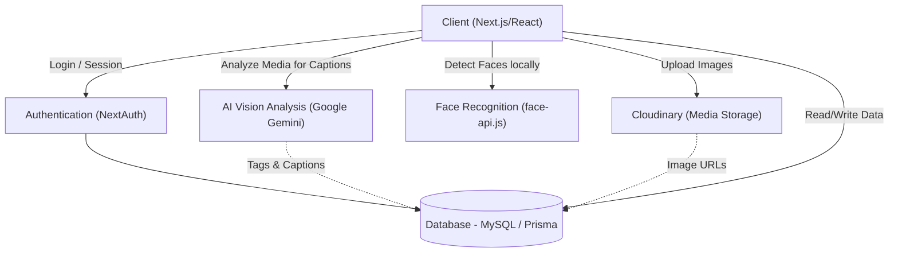
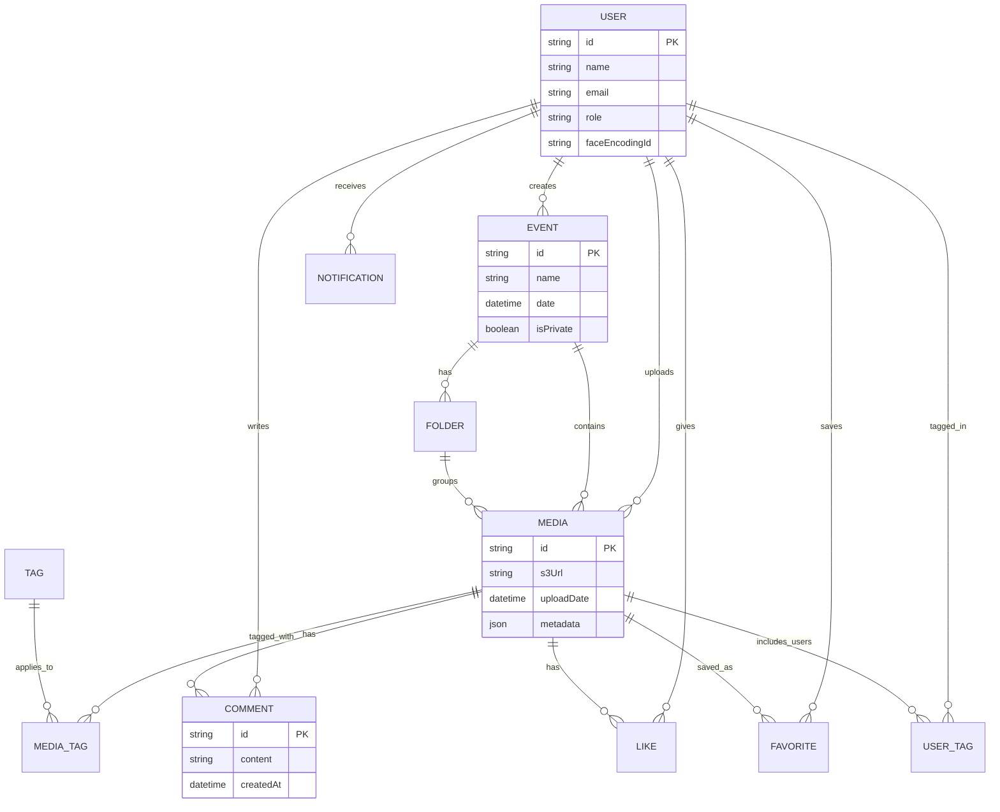

# GlimSync 📸

**GlimSync** is a cutting-edge, AI-powered platform designed for photographers and event organizers to effortlessly manage event media, auto-tag guests using facial recognition, and automatically generate smart captions and tags for photos using advanced AI models.

## 🚀 Live Demo
**[Working Deployed Project / Demo](https://event-management-glimsync-cig.vercel.app/)**

## ✨ Key Features
- **Smart Auto-Tagging:** Automatically detects and tags guests in photos using client-side facial recognition (`face-api.js`).
- **AI Media Analysis:** Generates automatic captions and smart tags for uploaded images using Google Gemini AI (`@google/generative-ai`).
- **Event Galleries:** Create private or public events, upload media, and organize them into folders.
- **Social Interactions:** Like, comment, favorite, and share photos effortlessly.
- **Instant Notifications:** Get notified when you are tagged, or when someone interacts with your uploads.

---

## 🏗️ Architecture Diagram



---

## 🗄️ Database Schema

The database is designed using Prisma ORM with MySQL. Below is an Entity-Relationship (ER) representation of the core schema:



### Core Entities:
- **User:** Manages roles (ADMIN, PHOTOGRAPHER, VIEWER), stores encrypted face encodings for recognition, and tracks interactions.
- **Event:** Represents a collection of media, can be public or private, and contains sub-folders.
- **Media:** The central entity storing the Cloudinary URL, AI-generated metadata (captions), and links to tags, comments, likes, and folders.
- **Tags & UserTags:** Bridges for standard keyword tags and AI-identified users respectively.
- **Notifications:** Tracks interactions (likes, tags, comments) to alert users in real-time.

---

## 🛠️ Tech Stack

- **Frontend:** Next.js 14, React 19, Tailwind CSS (Vanilla CSS structure), Lucide Icons
- **Backend:** Next.js App Router (API Routes)
- **Database:** MySQL, Prisma ORM
- **Authentication:** NextAuth.js (Credentials/Session based)
- **AI & ML:** 
  - `@vladmandic/face-api` (Client-side Facial Recognition)
  - `@google/generative-ai` (Gemini Pro Vision for image analysis)
- **Storage:** Cloudinary

---

## 💻 Local Setup Instructions

1. **Clone the repository**
   ```bash
   git clone https://github.com/chanchal624/event-management-Glimsync-CIG.git
   cd event-management-Glimsync-CIG
   ```

2. **Install dependencies**
   ```bash
   npm install
   ```

3. **Configure Environment Variables**
   Create a `.env` file in the root directory and add your keys:
   ```env
   DATABASE_URL="your_mysql_database_url"
   NEXTAUTH_SECRET="your_nextauth_secret"
   NEXTAUTH_URL="http://localhost:3000"
   CLOUDINARY_CLOUD_NAME="your_cloud_name"
   CLOUDINARY_API_KEY="your_api_key"
   CLOUDINARY_API_SECRET="your_api_secret"
   GEMINI_API_KEY="your_google_gemini_api_key"
   ```

4. **Initialize Database**
   ```bash
   npx prisma generate
   npx prisma db push
   ```

5. **Run the development server**
   ```bash
   npm run dev
   ```
   Open [http://localhost:3000](http://localhost:3000) to view it in the browser.
